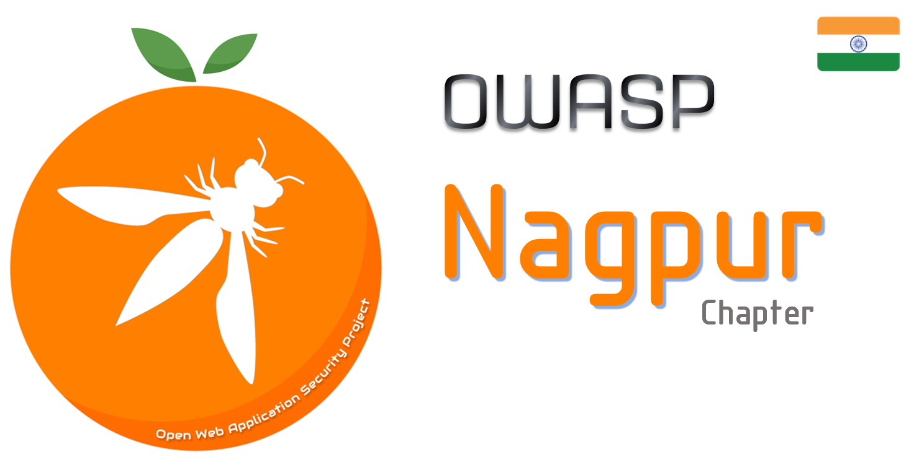

---

layout: col-sidebar
title: OWASP Nagpur
tags: nagpur india infosec owaspnagpur appsec ctf security
level: 0
site_side: true
region: Middle East

---

<!-- rebuild -->

## Welcome
Welcome to OWASP Nagpur Chapter.The chapter leaders are <a href="mailto:tushar.kulkarni@owasp.org">Tushar Kulkarni</a>, <a href="mailto:hrishikesh.somchatwar@owasp.org">Hrishikesh Somchatwar</a> and <a href="mailto:sahil.tembhare@owasp.org">Sahil Tembhare</a>.The Chapter's vision is to spread awareness about the Application Security among not just the citizens of Nagpur but beyond that too.It will conduct meets every now and then about the trends in the security community.

## Participation
The Open Web Application Security Project (OWASP) is a nonprofit foundation that works to improve the security of software. All of our projects ,tools, documents, forums, and chapters are free and open to anyone interested in improving application security. 

Chapters are led by local leaders in accordance with the [Chapter Leader Handbook](/www-policy/rules-of-procedure/chapter-handbook). Financial contributions should only be made online using the authorized online donation button. To be a SPEAKER at ANY OWASP Chapter in the world simply review the [speaker agreement](/www-policy/speaker-agreement) and then contact the local chapter leader with details of what OWASP Project, independent research, or related software security topic you would like to present.

Everyone is welcome and encouraged to participate in our [Projects](/projects), [Local Chapters](/chapters), [Events](/events), [Online Groups](https://groups.google.com/a/owasp.com/){:target='_blank'}, and [Community Slack Channel](https://owasp.slack.com/){:target='_blank'}. We especially encourage diversity in all our initiatives. OWASP is a fantastic place to learn about application security, to network, and even to build your reputation as an expert. We also encourage you to be [become a member](/membership) or consider a [donation](/donate) to support our ongoing work.

## Local News
- Meeting Location
- Everyone is welcome to join us at our chapter meetings which are free to attend.Just come with an open mind and willingness to share and learn..

Support & Sponsors
----------------
The following are the list of organizations/teams who have supported the OWASP Nagpur chapter in some or the other way:

<table cellpadding="15" cellspacing="0">
<tr>
<td height="150" width="150" >

</td>

<td height="150" width="150" >

</td>
</tr>
</table>

